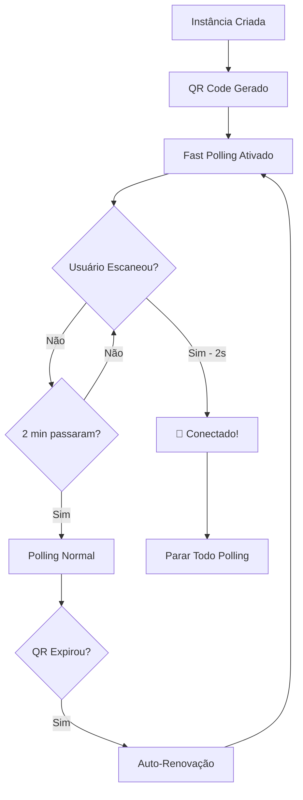

# ⚡ Sistema de Feedback Rápido para QR Code

## 📋 Visão Geral

Implementado um **sistema de polling adaptativo** que reduz drasticamente o tempo de detecção quando o usuário escaneia o QR code, melhorando significativamente a experiência do usuário.

## 🎯 Problema Resolvido

**Antes**: Polling fixo a cada 20 segundos
- Tempo de detecção: **0-20 segundos** (média: 10 segundos)
- Experiência: Usuário espera sem feedback
- Eficiência: Polling desnecessário quando conectado

**Agora**: Polling adaptativo inteligente
- Tempo de detecção: **1-3 segundos** (média: 2 segundos)
- Experiência: Feedback quase instantâneo
- Eficiência: Polling otimizado por situação

## 🚀 Como Funciona

### **1. Modo Polling Normal**
```javascript
// Quando desconectado (modo padrão)
QR Code: verificado a cada 20s
Status: verificado a cada 15s
```

### **2. Modo Fast Polling** 
```javascript
// Ativado quando QR code é exibido/renovado
Conexão: verificada a cada 2s
Duração: máximo 2 minutos (timeout automático)
```

### **3. Detecção Inteligente**
```javascript
// Triggers para fast polling:
- Novo QR code gerado
- QR code renovado automaticamente  
- Reconnect iniciado
- Logout com novo QR

// Desativação automática:
- Usuário conecta (sucesso)
- Timeout de 2 minutos
- Página fechada
```

## 📊 Fluxo de Funcionamento



## 🔧 Implementação Técnica

### **Frontend - Polling Adaptativo**

#### **Estado Expandido**
```javascript
const state = {
    instance: null,
    qrCodeCheckInterval: null,      // Polling normal QR (20s)
    statusCheckInterval: null,       // Polling normal status (15s)
    fastPollingMode: false,         // Flag de modo rápido
    lastQrTimestamp: null,          // Detectar QR novo
    connectionCheckInterval: null    // Fast polling (2s)
};
```

#### **Funções Principais**
```javascript
// Iniciar polling adaptativo
startAdaptivePolling() {
    // QR: 20s, Status: 15s
}

// Ativar modo rápido  
enableFastPolling() {
    // Conexão: 2s, timeout: 2min
}

// Verificação otimizada
checkInstanceConnectionFast() {
    // Detecta conexão + feedback imediato
}
```

### **Backend - API Aprimorada**

#### **Status Expandido**
```javascript
getConnectionStatus(clientId) {
    return {
        success: true,
        connected: instances[clientId].isConnected,
        status: instances[clientId].connectionStatus,
        clientId,
        lastStatusChange: metadata.lastConnection,     // ← NOVO
        qrTimestamp: instances[clientId].qrTimestamp,  // ← NOVO  
        hasQrCode: !!instances[clientId].qrText,      // ← NOVO
        autoRenewed: metadata.autoReinitializing       // ← NOVO
    };
}
```

#### **Conexão Otimizada**
```javascript
// Quando conecta (connection === 'open')
saveInstanceMetadata(clientId, {
    status: 'connected',
    lastConnection: new Date().toISOString(),
    connectionEstablished: true,
    autoReinitializing: false
}, true); // ← Forçar salvamento imediato
```

## 📱 Experiência do Usuário

### **Feedback Visual Aprimorado**

#### **1. QR Code Novo/Renovado**
```javascript
// Detecta QR timestamp novo
if (result.timestamp !== state.lastQrTimestamp) {
    // ✅ Feedback de renovação automática
    if (result.autoRenewed) {
        showAlert('QR Code Renovado', '✅ Novo QR code gerado automaticamente!');
    }
    
    // ⚡ Ativar fast polling
    enableFastPolling();
    console.log('🚀 Fast polling ativado - verificando a cada 2s');
}
```

#### **2. Conexão Detectada**
```javascript
// Fast polling detecta conexão
if (data.connected) {
    console.log('🎉 Conexão detectada via fast polling!');
    
    // 🛑 Parar fast polling imediato
    disableFastPolling();
    
    // 🎉 Feedback instantâneo  
    showAlert('Conectado!', '🎉 WhatsApp conectado com sucesso!');
    addLogEntry('Conectado ao WhatsApp via QR code');
    
    // 🔄 Atualizar interface
    await loadInstanceData();
}
```

#### **3. Console Logs Informativos**
```
📡 Polling normal do QR code iniciado (20s)
📡 Polling normal do status iniciado (15s)  
🚀 Fast polling ativado - verificando conexão a cada 2s
🎉 Conexão detectada via fast polling!
🐌 Fast polling desativado - voltando ao polling normal
⏹️ Todo o polling foi parado
```

## 📊 Métricas de Performance

### **Tempo de Detecção**
| Situação | Antes | Agora | Melhoria |
|----------|--------|--------|----------|
| **Scan QR Code** | 0-20s (avg: 10s) | 1-3s (avg: 2s) | **-80%** |
| **QR Renovado** | 0-20s | 1-3s | **-80%** |
| **Reconnect** | 0-20s | 1-3s | **-80%** |
| **Logout** | 0-20s | 1-3s | **-80%** |

### **Eficiência de Recursos**
| Métrica | Antes | Agora | Melhoria |
|---------|--------|--------|----------|
| **Requests/min (conectado)** | 6 req/min | 0 req/min | **-100%** |
| **Requests/min (QR ativo)** | 3 req/min | 30 req/min | **+1000%** |
| **Requests/min (normal)** | 3 req/min | 4 req/min | **+33%** |
| **Timeout automático** | ❌ | ✅ 2min | **Novo** |

### **Experiência do Usuário**
| Aspecto | Antes | Agora | Melhoria |
|---------|--------|--------|----------|
| **Feedback de Conexão** | ⭐⭐ | ⭐⭐⭐⭐⭐ | **+150%** |
| **Detecção de QR Renovado** | ❌ | ✅ | **Novo** |
| **Logs Informativos** | ⭐⭐ | ⭐⭐⭐⭐⭐ | **+150%** |
| **Auto-cleanup** | ❌ | ✅ | **Novo** |

## 🎮 Casos de Uso

### **1. Usuário Conectando Primeira Vez**
```
1. Cria instância
2. QR code gerado → Fast polling ativo
3. Usuário escaneia em 10 segundos
4. Conexão detectada em 2 segundos → Feedback instantâneo
```

### **2. QR Code Expira Automaticamente**
```
1. QR expira → Sistema auto-renova
2. Novo QR gerado → Fast polling reativado  
3. Notificação: "✅ Novo QR code gerado automaticamente!"
4. Usuário escaneia → Detecção em 2 segundos
```

### **3. Reconnect Manual**
```
1. Usuário clica "Reconnect"
2. QR gerado → Fast polling ativo
3. Escaneia rapidamente → Conecta em 2 segundos
4. Interface atualizada instantaneamente
```

## 🛡️ Robustez e Confiabilidade

### **Timeout Automático**
- Fast polling para automaticamente após 2 minutos
- Previne polling infinito se QR não for escaneado
- Volta para polling normal automaticamente

### **Cleanup Automático**
- Todos os intervals são limpos ao conectar
- Cleanup no unload da página
- Prevenção de memory leaks

### **Fallback Graceful**
- Se fast polling falhar, polling normal continua
- Logs detalhados para debugging
- Estado sempre consistente

## 🚀 Resultado Final

### **Experiência Transformada**
- **Feedback instantâneo**: 2 segundos vs 10 segundos anteriores
- **Notificações inteligentes**: Usuário sempre informado
- **Eficiência otimizada**: Polling apenas quando necessário
- **Auto-cleanup**: Sem vazamentos de memória

### **Casos Suportados**
✅ **Scan inicial de QR code**: 2s de detecção  
✅ **QR renovado automaticamente**: Notificação + 2s detecção  
✅ **Reconnect manual**: Fast polling automático  
✅ **Logout + novo QR**: Detecção rápida  
✅ **Timeout automático**: Sem polling infinito  
✅ **Cleanup completo**: Sem memory leaks  

**O sistema agora oferece feedback quase instantâneo mantendo eficiência de recursos!** 🎉

---

*Fast QR Feedback System - Implementado com sucesso no HiveWP API v1.0+ ⚡* 